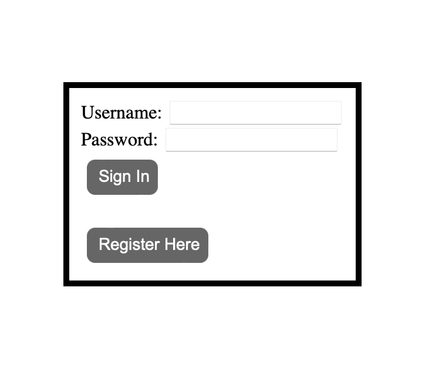
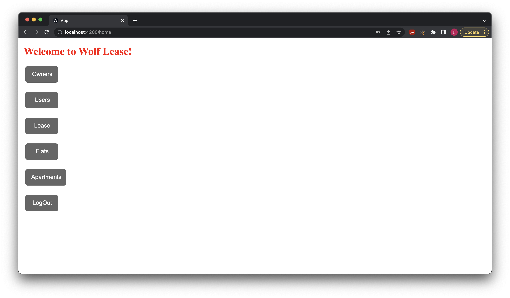
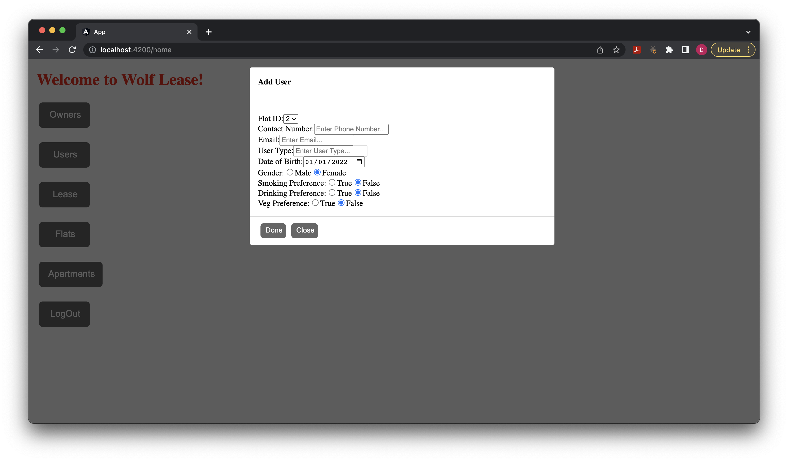
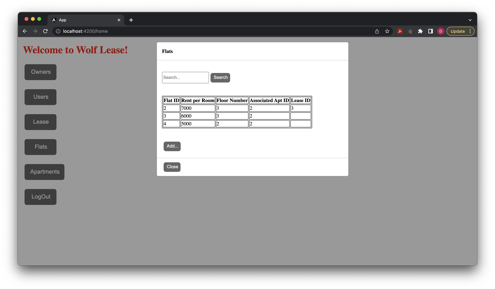
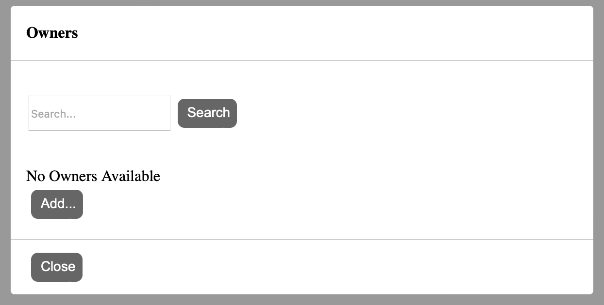

# WolfLease Application Front

This project was generated with [Angular CLI](https://github.com/angular/angular-cli) version 13.2.6.

## Development server

If you want to locally develop and change something in code base, then you need to clone this github repo and then go inside angular folder and then run

`npm start` 

Then you can go to `http://localhost:4200/` to test your changes.

## Code scaffolding

Run `ng generate component component-name` to generate a new component. You can also use `ng generate directive|pipe|service|class|guard|interface|enum|module`.

## Build

Run `ng build` to build the project. The build artifacts will be stored in the `dist/` directory.

## Running unit tests

Run `ng test` to execute the unit tests via [Karma](https://karma-runner.github.io).

## Running end-to-end tests

Run `ng e2e` to execute the end-to-end tests via a platform of your choice. To use this command, you need to first add a package that implements end-to-end testing capabilities.

## Further help

To get more help on the Angular CLI use `ng help` or go check out the [Angular CLI Overview and Command Reference](https://angular.io/cli) page.

## Screenshots

### Login Page

### Home Page

### User Form

### Owners

### Owner Add
